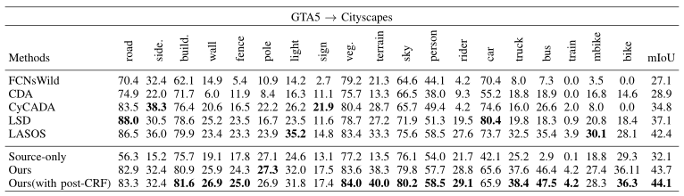
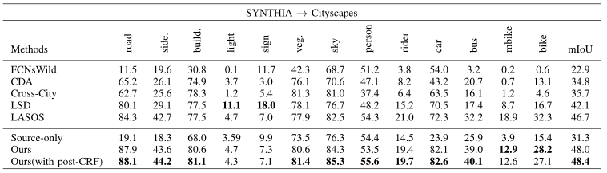

## Performance



## Installation
* Python 3.6
* pytorch 0.4.1
* cuda 8.0
* pip install pydensecrf


## Dataset
* Download the [GTA5 Dataset](https://download.visinf.tu-darmstadt.de/data/from_games/) as the source domain, and put it in the `data/GTA5` folder

* Download the [Cityscapes Dataset](https://www.cityscapes-dataset.com/) as the target domain, and put it in the `data/Cityscapes` folder

## Testing
* Download the pre-trained multi-level [GTA5-to-Cityscapes model](http://vllab.ucmerced.edu/ytsai/CVPR18/GTA2Cityscapes_multi-ed35151c.pth) and put it in the `model` folder

* Test the model and results will be saved in the `result` folder

* Compute the IoU on Cityscapes
```
python evaluate_cityscapes.py 
python compute_iou.py ./data/Cityscapes/data/gtFine/val result/gta
```

## Training Examples
* Train the GTA5-to-Cityscapes model

```
python train_gta2citys.py 
```

## Related Implementation and Dataset
* Y.-H. Tsai and W.-C. Hung and S. Schulter and K. Sohn and M.-H. Yang and M. Chandraker. Learning to Adapt Structured Output Space for Semantic Segmentation. In ArXiv, 2018. [[paper]](https://arxiv.org/abs/1802.10349) [[code]](https://github.com/wasidennis/AdaptSegNet)

## Acknowledgment
This code is heavily borrowed from [LASOS](https://github.com/wasidennis/AdaptSegNet).

## Note
The model and code are available for non-commercial research purposes only.
* 03/2019: code released


